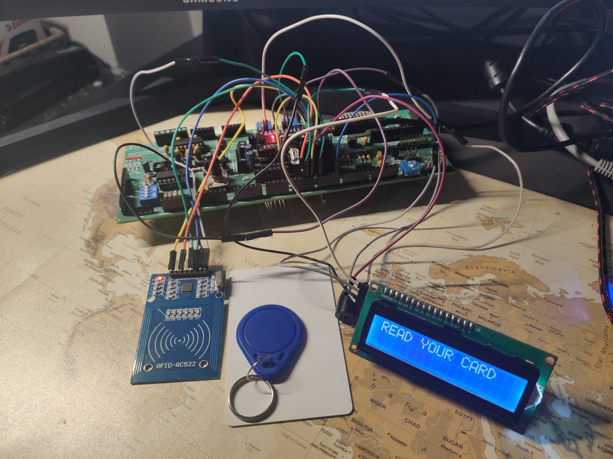
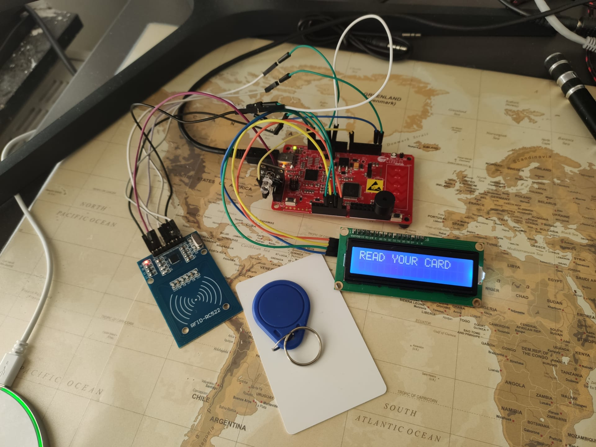
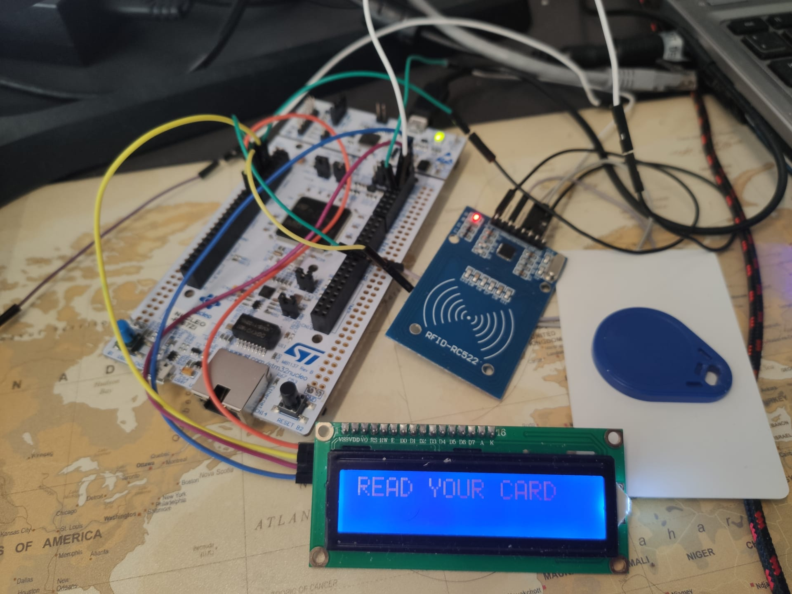
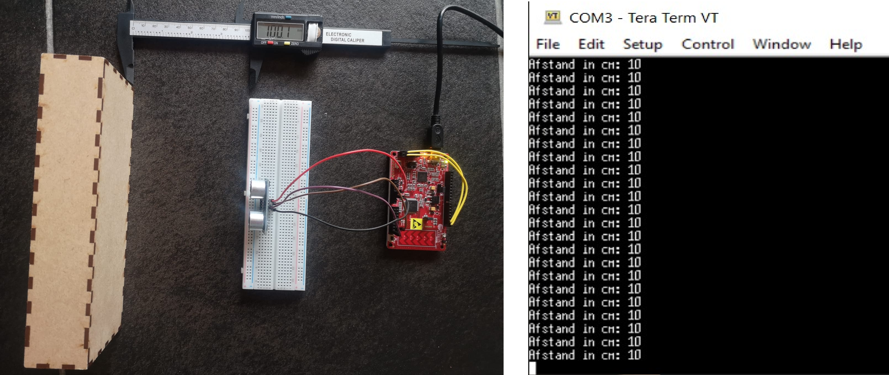
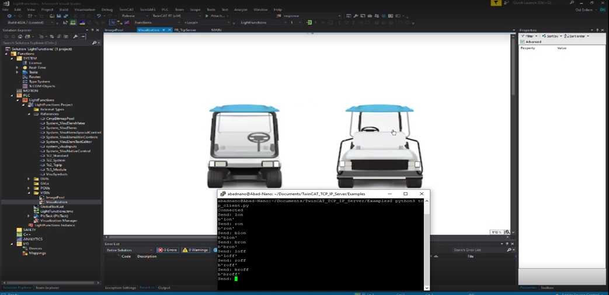
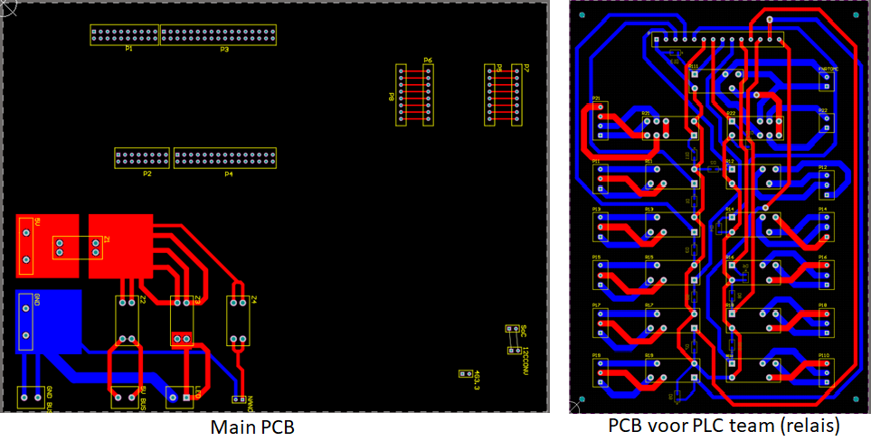
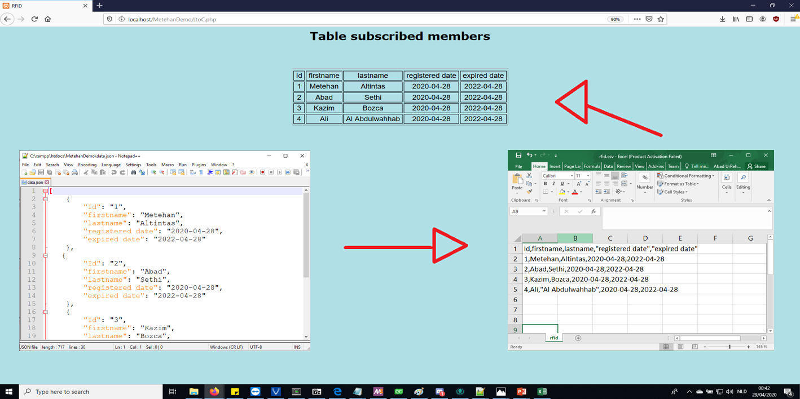
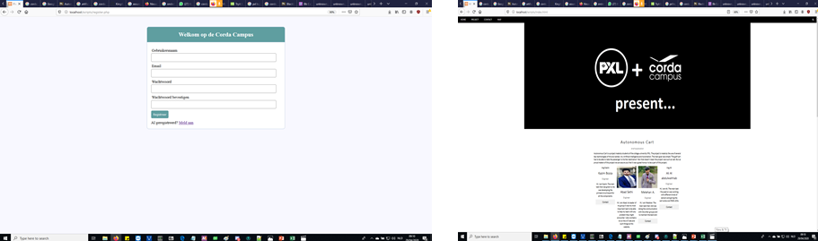

# Project - Autonomous cart

Autonomous cart was one of the 3 main projects of the subject **Project Reasearch** given by several professors of the university-college **PXL**. The main goal of Autonomous cart was to turn an ordinary golf cart into a fully self-driving campus taxi that takes it passengers to their desired locations. The three main technologies that were needed to make this project a succes were: IOT, AI and Automation technology. As of our task to be the brain of this project it was our main responsibility to the IOT side of this project. And that is also what this repository is about.  


## Source Roadmap

```
RFID_Project_Arduino           directory containing RFID system with Arduino files
RFID_Project_PSoC4             directory containing RFID system with PSoC4 files
RFID_Project_STM               directory containing RFID system with STM files
TCP_IP_JETSON_PLC              directory containing Server (twincat) and Client (python) code
Distance_Measurement_PSOC4     directory containing Distance measurement with PSoC 4 files
PCB_ACTUAL                     directory containing all of the Altium designs for the main pcb
PCB_RELAIS7-4                  directory containing all of the Altium designs for the relais pcb
Data_Visualisation             directory containing the script to show csv content on webpage
Website                        directory containing all the html code and php scripts for the website
Presentaties                   directory containing all of the powerpoint presentations given during this project
```

## All of the projects made by our group
<details> 
 
<summary>Click to see all projects</summary>
  
## RFID project with Arduino

<details>
<summary>Click to expand the RFID project with Arduino</summary> 
 
 <p align="center"></p>

**Project requirements**
* Jumper wires
* RFID-RC522
* RFID tags
* IIC LCD-Display
* Buzzer module
* RGB led
* Breadboard
* Arduino IDE
* Arduino

**Step by step guide**
* Open the Arduino IDE. 
* Plug in your Arduino Nano (used by me) in your laptop.
* Start making your circuit (open my schematic).
* Copy and paste the my .ino code in your IDE.
* Look if you have the right board selected.
* Also select the right serial COM port your Arduino is connected to.
* Upload the code into your Arduino and it should work.

**Note:**
 You have to change the UID of mine tag to the UID of your tag.
To know this UID open one of the simple RFID-RC522 reading examples in the Arduino IDE.
</details>  

## RFID project with PSoC4

<details>
<summary>Click to expand the RFID project with PSoC4</summary> 
 
  <p align="center"></p>
  
 **Project requirements**
* Jumper wires
* RFID-RC522
* RFID tags
* IIC LCD-Display
* Buzzer module
* RGB led
* Breadboard
* PSoC Creator 4.2
* PSoC 4

**Step by step guide**
* Open the PSoC Creator 4.2 download available at the official cypress site. 
* Import my project in the ide.
* If you are using a different PSoC you might have to change the target device and pin settings.
* Plug in your PSoC 4 (used by me) in your laptop.
* Start making your circuit.
* Clean and build the project once.
* Upload the code into your PSoC 4 and it should work.

**Note:**
 This code is made to work with any **RFID-tag** it just detects wheter any tag is detected by the reader or not.
 With some minimal changes to the code you can make it work for a certain specific tag.
</details> 

## RFID project with STM

<details>
<summary>Click to expand the RFID project with STM</summary> 
 
  <p align="center"></p>
 
 **Project requirements**
* Jumper wires
* RFID-RC522
* RFID tags
* IIC LCD-Display
* Breadboard
* STMCubeIDE 1.3.0
* STM32xxxx µController

**Step by step guide**
* Open the  STMCubeIDE 1.3.0 download available at the official st.com site. 
* Import my project in the IDE.
* If you are using a different STM you might have to change device with the board selector.
* Plug in your STMµController into your laptop.
* Start making your circuit.
* Clean and build the project once.
* Upload the code into your STMµContoller and it should work.

**Note:**
 You have to change the UID of mine tag to the UID of your tag.
To know this UID open one of the simple RFID-RC522 reading examples in the Arduino IDE.
And use it afterwards in the code. If you don't have the Arduino IDE then donwload an RFID reader
app on your smartphone it should work if your device supprots NFC.
</details> 

## Distance measurement with PSOC4

<details>
<summary>Click to expand the RFID project with STM</summary> 
 
  <p align="center"></p>
 
 **Project requirements**
* Jumper wires
* HC-SR04
* PSoC 4
* Breadboard
* PSoC Creator 4.2
* Serial monitor (UART)
* Digital caliper (optional)

**Step by step guide**
* Open the PSoC Creator 4.2 download available at the official cypress site. 
* Import my project in the ide.
* If you are using a different PSoC you might have to change the target device and pin settings.
* Plug in your PSoC 4 (used by me) in your laptop.
* Start making your circuit.
* Clean and build the project once.
* Upload the code into your PSoC 4 and it should work.
* Open your UART terminal eg. Tera Term and you should see your incoming output distance there.

**Note:**
 You can use the caliper to double check if the distance outputted by your ultrasonic sensor is correct or not.
</details> 

## TCP-IP communication between Jetson and PLC

<details>
<summary>Click to expand the TCP-IP communication between Jetson and PLCs</summary> 

 <p align="center"></p>
 
 **Project requirements**
* Jetson Nano
* Jetson Nano display
* Twincat 3 V4024.7

**Step by step guide**
* Open the Twincat XAE or open it in Visual Studio.
* Open the Twincat server project in your solution.
* Go on the Jetson Nano terminal and install python3.
* First run the PLC server on Twinact 
* now run the client program on the Jetson Nano.
* Now you should be able to see incoming messages in the server that you sent with the client.

**Note:**
 TwinCAT Error and Error ID are stored in the variable 'err' and 'errid' respectively. Some common errors found:
  * 8002 : Variable 'hSocket' is not populated with the correct address. The sequence is for the TwinCAT to call FB_SocketListen, the Python client to connect, and TwinCAT calls the FB_SocketAccept after that. This will populate the variable 'hSocket'. If FB_SocketAccept is called before the Python client trying to connect, it will throw 8002 error.
 * 8003 : The port is already opened. Reset Cold the TwinCAT program and Run again.
 * 6 : I don't know. Seems like there's something wrong with the installation of TF6310. Uninstall, reinstall, make sure that     TcpIpServer.exe is running in your Task Manager processes.

</details> 

## PCB design using Altium

<details>
<summary>Click to read details about the PCB design using Altium</summary> 
  
  <p align="center"></p>
  
 **Project requirements**
* Altium software
* Altium license
* Knowledge of PCB-designing

**Step by step guide**
* Open Altium designer.
* Download the pcb files from this GitHub.
* Import them in your environment.
* Now you should see the PCB that we made.

**Note:**
 If you make any changes make to the PCB design make sure to have it checked by a professional.
  
</details> 

## Data visualisation

<details>
<summary>Click to expand the Data visualisation project</summary> 
  
  <p align="center"></p>
  
 **Project requirements**
* Texteditor
* XAMPP
* A webbrowser

**Step by step guide**
* Download all the files under the Data_Visualisation folder.
* Save all of the files in one folder.
* Download XAMPP from the official website.
* Open XAMPP and start Apache and MySQL.
* Now open the JtoC.php file on localhost.
* Now you should be able to see a table on a webpage.

**Note:**
 All the files must be int your XAMPP/htdocs/ directory in order to work on localhost.
</details> 

## Website

<details>
<summary>Click to expand the Website details</summary> 
 
  <p align="center"></p>
 
 **Project requirements**
* Texteditor
* PHPmyAdmin account
* XAMPP
* A webbrowser

**Step by step guide**
* Download all the files under the Website folder.
* Save all of the files in one folder.
* Download XAMPP from the official website.
* Open XAMPP and start Apache and MySQL.
* Open this link http://localhost/phpmyadmin.
* Make a new database and table
* Now open the register.php file on localhost.
* Now you should be able to see the page where users can register.
* All of the users are saved in the PHPmyAdmin database.
* Once logged in you can see the main page.


**Note:**
 Edit the server.php file according to your database and table name. Otherwise it won't work
  
</details> 
</details> 

## Built With

* [Arduino IDE](https://www.arduino.cc/en/Main/Software/)       - Programming environment used for the Arduino
* [PSoC Creator 4.2](https://www.cypress.com/products/psoc-creator-integrated-design-environment-ide/)  - Programming environment used for the PSoC 4
* [STMCubeIDE 1.3.0](https://www.st.com/en/development-tools/stm32cubeide.html/) - Programming environment used for the STMµController
* [Twincat](https://www.beckhoff.com/english.asp?download/tc3-downloads.htm) - Programming environment used for the PLC server
* [Notepad++](https://notepad-plus-plus.org/downloads/) -  Programming environment used for the website
* [Python](https://www.python.org/) - The programming language used for the client 
* [XAMPP](https://www.apachefriends.org/download.html/) - The localhost server program
* [PHPmyAdmin](https://www.phpmyadmin.net/) - The database used

## Our team

* **Bart Stukken**     - Scrum master - [LinkedIn](https://www.linkedin.com/in/bart-stukken/)
* **Frederik Vreys**    - Product owner - [LinkedIn](https://www.linkedin.com/in/frederik-vreys-b42214aa/)
* **Abad Sethi**        - Developer  - [LinkedIn](https://www.linkedin.com/in/abad-sethi-83246a170/)
* **Kazim Bozca**       - Developer
* **Metehan Altintas**   - Developer 
* **Ali Alabdulwahhab**  - Developer 

<p align="left"></p>
